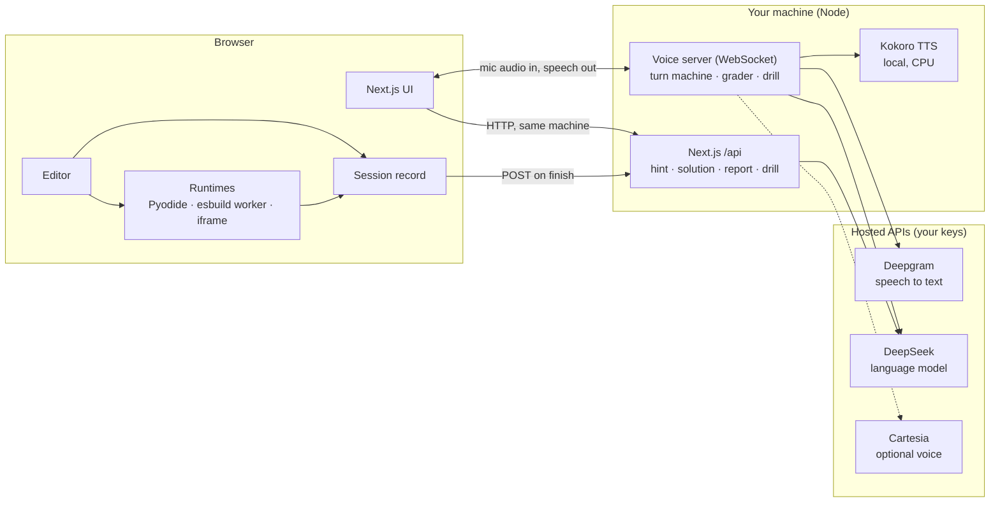

# interview-ai

A local, single-user tool for practising **live coding interviews**: a voice
interviewer talks to you while you write code in a shared editor, then a report
afterwards tells you whether the thing holding you back was the knowledge or the
English.

Everything runs on this machine. Code executes in the browser — Pyodide for
Python, an esbuild-powered worker for TypeScript, a sandboxed iframe for React —
and the interviewer's voice is a local 82M model, so an idle session costs
nothing and there is no meter running.

There are three ways to practise, because real loops have three shapes: a coding
round with an interviewer watching you type, a spoken question explored for
twenty minutes, and a **rapid-fire drill** — ten questions at sixty seconds each
with no follow-ups, which is what a screen actually does and which trains recall
under pressure rather than reasoning.

## Running it

Needs Node 22.9 or later and pnpm.

```bash
cp .env.example .env.local   # then add your keys
pnpm install
pnpm dev     # UI on :3000, voice server on :8787
```


```bash
pnpm test    # everything free and deterministic, ~8s
```

## Features

- **Voice interviewer.** It opens the round, reacts to the code you write, runs your tests when it chooses to, and can be interrupted mid-sentence.
- **Three runtimes in the browser.** Python with real `sqlite3` (Pyodide), TypeScript test suites (esbuild worker), and React with a live preview (sandboxed iframe). Nothing is sent to a server to run.
- **Shared editor** with syntax linting, per-problem starter code and a timer.
- **Hint ladder.** Hints go from vague to specific, and the report records how many you used.
- **15 coding problems** — algorithms, SQL, and practical cases such as retries, rate limiting, caching and idempotent payments.
- **Spoken questions** — concepts, trade-offs, code review, system design, AI and behavioural. A grader scores your answer against the points a good answer should hit.
- **Rapid-fire drills** — ten questions, sixty seconds each, no follow-ups, ~77 questions across JavaScript, C#/.NET, React, databases, TypeScript and the web.
- **Post-session report** that separates what you knew from how you said it: pace, silences, hedging, and quotes from the transcript as evidence.
- **Resumable sessions** with automatic reconnection and a history page.
- **Answer keys stay on the server.** `pnpm verify:bundle` checks that no solution or hint reaches a file the browser downloads.

## Architecture



The browser executes code and keeps the evidence for the report. The server
holds the answer keys and every API key. Constraints that shape this split are
in [`AGENTS.md`](AGENTS.md).

## Bring your own keys

There is no hosted service. You run it locally and supply your own keys in
`.env.local`; they stay on your machine and are read only by the Node servers,
never sent to the browser.

| Key | Used for | Required? |
|---|---|---|
| `DEEPSEEK_API_KEY` | The interviewer, hints, the grader and the report | For anything that needs a model |
| `DEEPGRAM_API_KEY` | Turning your microphone audio into text | For spoken rounds and drills |
| `CARTESIA_API_KEY` | A hosted interviewer voice | Only if `TTS_PROVIDER=cartesia` |

The default voice is Kokoro, a local model, so it needs no key and has no
per-character cost. DeepSeek, Deepgram and Cartesia bill you directly according
to their own pricing, and Deepgram bills for audio *streamed*, so an open
microphone costs the same whether you talk or sit in silence.

Without any keys the editor, the three runtimes, the timer and the reference
solutions still work. The voice server refuses to start without the DeepSeek
and Deepgram keys.

## Security

This is a local tool whose servers spend your paid API keys, so they listen on
`127.0.0.1` only. The WebSocket voice server and every `/api` route also refuse
requests from any browser origin that is not loopback, so a web page you visit
cannot drive them. To serve it elsewhere, set `VOICE_SERVER_HOST` and list the
page's origin in `ALLOWED_ORIGINS` (comma-separated) — and put authentication in
front of it first. `.env.local` is gitignored; never commit it.

## Where the real documentation is

**[`AGENTS.md`](AGENTS.md)** — the architecture, and more importantly the eight
constraints that are easy to re-break by accident. Read it before changing
anything: several of them look like arbitrary choices and are not.


## Layout, briefly

| Path | What lives there |
|---|---|
| `problems/` | Coding problems as typed modules. Answer keys never reach the browser. |
| `questions/` | The spoken question bank — concepts, trade-offs, code review, system design, behavioural. |
| `questions/canon/` | The rapid-fire banks: ~77 sixty-second questions, transcribed from real screens. |
| `lib/runtime/` | The worker protocol and the client that supervises execution. |
| `public/workers/` | The two execution workers. Plain JS on purpose — see constraint 1. |
| `lib/session/` | Session state, the clock, drafts, history, and the evidence record. |
| `server/pipeline/` | Speech to text, text to speech, and the language model behind one interface. |
| `server/interview/` | The prompt builder, the turn state machine, the coverage grader, the report. |
| `server/interview/drill.ts` | The rapid-fire driver: a timer and a speech queue, with no model in the loop. |

## Licence

MIT — see [`LICENSE`](LICENSE).
